# BRAIN CRM - Architecture Documentation

## Table of Contents

1. [System Overview](#1-system-overview)
2. [Component Diagram](#2-component-diagram)
3. [Authentication & Authorization Flow](#3-authentication--authorization-flow)
4. [Data Model (ERD)](#4-data-model-erd)
5. [Local Deployment Architecture](#5-local-deployment-architecture)
6. [Customers Kanban Flow](#6-customers-kanban-flow)
7. [Realtime Chat Flow](#7-realtime-chat-flow)
8. [Multi-Tenant Security (RLS)](#8-multi-tenant-security-rls)
9. [Storage Convention](#9-storage-convention)
10. [Technology Stack](#10-technology-stack)

---

## 1. System Overview

BRAIN CRM é um sistema multi-tenant responsável por consolidar dados de múltiplos CRMs. A arquitetura segue o padrão:

- **Frontend**: Vite + React + TypeScript + Tailwind CSS
- **BFF**: Node.js + Express (opcional, para operações privilegiadas)
- **Backend**: Supabase Local (PostgreSQL + PostgREST + GoTrue + Storage + Realtime)

**Princípios arquiteturais:**
- Multi-tenancy com Row Level Security (RLS)
- Isolamento completo de dados por tenant
- Autenticação JWT com claims customizados
- Realtime subscriptions para chat
- Storage com path-based tenant isolation

---

## 2. Component Diagram


---

## 3. Authentication & Authorization Flow

```mermaid
sequenceDiagram
    actor User as 👤 Usuário
    participant FE as Frontend
    participant Auth as GoTrue (Auth)
    participant REST as PostgREST
    participant DB as Postgres (RLS)

    %% Login Flow
    rect rgb(240, 248, 255)
        Note over User,DB: 🔐 Fluxo de Login
        User->>FE: 1. Acessa /login
        FE->>Auth: 2. signIn(email, password)
        Auth->>DB: 3. Valida credenciais em auth.users
        DB-->>Auth: 4. Retorna user_id
        Auth->>DB: 5. Busca role em brain.equipe
        DB-->>Auth: 6. Retorna tenancy_id + role
        Auth-->>FE: 7. JWT (access_token + refresh_token)<br/>+ user metadata (tenancy_id, role)
        FE->>FE: 8. Guarda session no localStorage
        FE->>User: 9. Redireciona para dashboard
    end

    %% Query Flow com RLS
    rect rgb(240, 255, 240)
        Note over User,DB: 📊 Fluxo de Query (RLS)
        User->>FE: 10. Acessa Customers Kanban
        FE->>REST: 11. GET /brain/view_clientes_kanban<br/>Header: Authorization Bearer {JWT}
        REST->>DB: 12. SET jwt.claims = {sub, tenancy_id, role}
        REST->>DB: 13. SELECT * FROM brain.view_clientes_kanban
        DB->>DB: 14. RLS policy:<br/>WHERE tenancy_id = brain.current_tenancy_id()
        DB-->>REST: 15. Retorna apenas dados do tenant do user
        REST-->>FE: 16. JSON response
        FE->>User: 17. Renderiza Kanban
    end
```



### Helper Functions para RLS

```sql
-- Retorna o tenant_id do usuário logado
CREATE OR REPLACE FUNCTION brain.current_tenancy_id()
RETURNS uuid AS $$
  SELECT COALESCE(
    (current_setting('request.jwt.claims', true)::jsonb->>'tenancy_id')::uuid,
    '00000000-0000-0000-0000-000000000000'::uuid
  );
$$ LANGUAGE sql STABLE;

-- Verifica se o usuário é admin
CREATE OR REPLACE FUNCTION brain.is_admin()
RETURNS boolean AS $$
  SELECT EXISTS(
    SELECT 1 FROM brain.equipe
    WHERE auth_user_id = auth.uid()
      AND role = 'admin'
      AND tenancy_id = brain.current_tenancy_id()
  );
$$ LANGUAGE sql STABLE SECURITY DEFINER;

-- Retorna o role do usuário
CREATE OR REPLACE FUNCTION brain.current_user_role()
RETURNS text AS $$
  SELECT role FROM brain.equipe
  WHERE auth_user_id = auth.uid()
    AND tenancy_id = brain.current_tenancy_id()
  LIMIT 1;
$$ LANGUAGE sql STABLE SECURITY DEFINER;
```

---

## 4. Data Model (ERD)


### Database Statistics

- **23 Tabelas** no schema `brain`
- **22+ ENUMs** para type safety
- **3 Views otimizadas**:
  - `view_clientes_kanban` - 5 colunas Kanban
  - `view_cliente_full` - Dados completos do cliente
  - `view_dashboard_stats` - Métricas agregadas
- **RLS habilitado** em todas as tabelas
- **Triggers** para `updated_at` automático

---

## 5. Local Deployment Architecture

```mermaid
flowchart TB
    subgraph Local["💻 Máquina Local do Desenvolvedor"]
        direction TB

        subgraph Docker["🐳 Docker Desktop"]
            direction LR

            subgraph SupabaseContainers["Supabase CLI Containers"]
                direction TB
                PG[("🗄️ PostgreSQL<br/>Port: 54322<br/>DB: postgres<br/>Schema: brain")]
                Kong["🌐 Kong Gateway<br/>Port: 54321<br/>API Gateway"]
                GoTrueC["🔐 GoTrue<br/>Port: 54324<br/>Auth Service"]
                RealtimeC["⚡ Realtime<br/>Port: 54323<br/>WebSocket"]
                StorageC["📦 Storage API<br/>Port: 54325"]
                Meta["📊 Meta API<br/>Migrations"]
                StudioC["🎨 Studio UI<br/>Port: 54323<br/>Admin Dashboard"]
                InbucketC["📧 Inbucket<br/>Port: 54324<br/>SMTP + Web UI"]
            end

            Kong --> PG
            GoTrueC --> PG
            RealtimeC --> PG
            StorageC --> PG
            Meta --> PG
            StudioC --> PG
        end

        subgraph ProcessVite["⚙️ Node Process (Vite)"]
            FrontendDev["📱 Frontend Dev Server<br/>Port: 5173<br/>npm run dev"]
        end

        subgraph ProcessBFF["⚙️ Node Process (Express)"]
            BFFDev["🔧 BFF Dev Server<br/>Port: 8080<br/>npm run dev"]
        end

        Browser["🌐 Browser<br/>http://localhost:5173"]

        Browser -->|HTTP| FrontendDev
        FrontendDev -->|anon key + JWT| Kong
        FrontendDev -->|Bearer token| BFFDev
        BFFDev -->|service role key| Kong
        BFFDev -->|SMTP| InbucketC
    end

    Dev[👨‍💻 Desenvolvedor]
    Dev -->|supabase start| Docker
    Dev -->|npm run dev| ProcessVite
    Dev -->|npm run dev| ProcessBFF
    Dev -->|acessa| Browser
    Dev -->|supabase db reset| Meta
    Dev -->|acessa admin| StudioC
    Dev -->|verifica emails| InbucketC

    classDef container fill:#0ea5e9,stroke:#0284c7,color:#fff
    classDef process fill:#f59e0b,stroke:#d97706,color:#fff
    classDef db fill:#8b5cf6,stroke:#6d28d9,color:#fff
    classDef external fill:#10b981,stroke:#059669,color:#fff

    class PG,Kong,GoTrueC,RealtimeC,StorageC,Meta,StudioC,InbucketC container
    class FrontendDev,BFFDev process
    class Browser,Dev external
```



### Port Mapping

| Serviço | Porta | Descrição |
|---------|-------|-----------|
| Kong (API Gateway) | 54321 | Entry point para Supabase APIs |
| PostgreSQL | 54322 | Banco de dados direto (psql) |
| Realtime | 54323 | WebSocket subscriptions |
| Supabase Studio | 54323 | Admin UI |
| GoTrue | 54324 | Auth service (interno) |
| Inbucket Web | 54324 | Ver emails de teste |
| Inbucket SMTP | 54325 | SMTP local |
| BFF | 8080 | Microservice backend |
| Frontend | 5173 | Dev server Vite |

---

## 6. Customers Kanban Flow

```mermaid
flowchart TD
    Start([👤 User acessa<br/>Customers Page]) --> LoadKanban

    LoadKanban["🔄 Frontend:<br/>useEffect carrega dados"] --> QueryView

    QueryView["📡 API Call:<br/>GET /brain/view_clientes_kanban<br/>Header: Authorization Bearer JWT"] --> RLS

    RLS{"🔒 RLS Check:<br/>tenancy_id match?"}

    RLS -->|✅ MATCH| ReturnData["📊 Postgres retorna:<br/>- cliente_id<br/>- nome_completo<br/>- cpf<br/>- kanban_lane<br/>(filtered by tenant)"]

    RLS -->|❌ NO MATCH| Forbidden["🚫 Empty result<br/>(RLS bloqueou)"]

    ReturnData --> GroupByLane["🗂️ Frontend agrupa<br/>por kanban_lane:<br/>- documentacao_pendente<br/>- documentacao_enviada<br/>- em_dia<br/>- provas<br/>- inadimplentes"]

    GroupByLane --> RenderKanban["🎨 Renderiza Kanban Board<br/>5 colunas com cards"]

    RenderKanban --> UserAction{"👆 User Action"}

    UserAction -->|Clica no card| OpenModal["📋 Abre CustomerCard Modal"]

    OpenModal --> LoadFullData["📡 GET /brain/view_cliente_full<br/>WHERE id = cliente_id"]

    LoadFullData --> RenderModal["🎨 Renderiza Modal com:<br/>- Dados pessoais<br/>- Contratos<br/>- Documentos<br/>- Timeline (logs)"]

    RenderModal --> ModalAction{"👆 Modal Action"}

    ModalAction -->|Aprova documento| UpdateDoc["📝 PATCH /brain/documentos_do_cliente<br/>SET status = 'aprovado'"]

    UpdateDoc --> TriggerLog["📊 Trigger insere em<br/>brain.logs (audit)"]

    TriggerLog --> RefreshKanban["🔄 Frontend recarrega Kanban"]

    RefreshKanban --> RenderKanban

    ModalAction -->|Fecha modal| RenderKanban

    UserAction -->|Drag & drop card| DragDrop["🖱️ Drag card entre lanes<br/>(UI apenas)"]

    DragDrop --> UpdateStatus["📝 Backend update:<br/>atualizar status/campo<br/>que define lane"]

    UpdateStatus --> RefreshKanban

    Forbidden --> ShowEmpty["📭 Mostra Kanban vazio<br/>(sem erro visível)"]

    ShowEmpty --> End([End])

    style Start fill:#60a5fa,stroke:#1e40af,color:#fff
    style End fill:#ef4444,stroke:#b91c1c,color:#fff
    style RLS fill:#f59e0b,stroke:#d97706,color:#fff
    style ReturnData fill:#34d399,stroke:#059669,color:#fff
    style Forbidden fill:#ef4444,stroke:#b91c1c,color:#fff
```



### Kanban Lane Logic

A view `view_clientes_kanban` calcula a lane baseada em regras de negócio:

```sql
CASE
  -- Inadimplentes: customers with overdue payments
  WHEN EXISTS (
    SELECT 1 FROM brain.parcelas p
    JOIN brain.contratos ct ON ct.id = p.contrato_id
    WHERE ct.cliente_id = c.id
      AND p.pago_em IS NULL
      AND p.vence_em < CURRENT_DATE
  ) THEN 'inadimplentes'

  -- Provas: customers with pending legal cases
  WHEN EXISTS (
    SELECT 1 FROM brain.juridico_processos jp
    WHERE jp.cliente_id = c.id
      AND jp.etapa IN ('aberto', 'agendado')
  ) THEN 'provas'

  -- Em Dia: customers with all payments up to date
  WHEN c.status_pagamento = 'em_dia' THEN 'em_dia'

  -- Documentação Enviada: customers with submitted docs
  WHEN EXISTS (
    SELECT 1 FROM brain.documentos_do_cliente doc
    WHERE doc.cliente_id = c.id
      AND doc.status = 'pendente'
  ) THEN 'documentacao_enviada'

  -- Documentação Pendente: default state
  ELSE 'documentacao_pendente'
END AS kanban_lane
```

---

## 7. Realtime Chat Flow

```mermaid
sequenceDiagram
    participant U1 as 👤 User 1 (Browser 1)
    participant FE1 as Frontend 1
    participant RT as Realtime Server
    participant DB as Postgres
    participant FE2 as Frontend 2
    participant U2 as 👤 User 2 (Browser 2)

    %% Setup subscriptions
    rect rgb(240, 248, 255)
        Note over U1,U2: 📡 Setup: Subscriptions
        U1->>FE1: Abre chat thread_id=123
        FE1->>RT: channel('chat-123')<br/>.on('INSERT', callback)<br/>.subscribe()
        RT->>DB: LISTEN brain.chat_mensagens

        U2->>FE2: Abre MESMO thread_id=123
        FE2->>RT: channel('chat-123')<br/>.on('INSERT', callback)<br/>.subscribe()
    end

    %% Load history
    rect rgb(240, 255, 240)
        Note over U1,DB: 📜 Load: Histórico
        FE1->>DB: GET /brain/chat_mensagens<br/>?thread_id=eq.123<br/>order=created_at.asc
        DB-->>FE1: [{msg1}, {msg2}, ...]
        FE1->>U1: Renderiza mensagens antigas

        FE2->>DB: GET /brain/chat_mensagens<br/>?thread_id=eq.123
        DB-->>FE2: [{msg1}, {msg2}, ...]
        FE2->>U2: Renderiza mensagens antigas
    end

    %% Send message
    rect rgb(255, 250, 240)
        Note over U1,DB: ✉️ Send: Nova Mensagem
        U1->>FE1: Digita "Olá!" e envia
        FE1->>DB: POST /brain/chat_mensagens<br/>{thread_id: 123, body: "Olá!",<br/>direction: "equipe"}
        DB->>DB: RLS check PASSA<br/>(tenancy_id match)
        DB->>DB: INSERT INTO brain.chat_mensagens<br/>VALUES (...)
    end

    %% Realtime notification
    rect rgb(255, 240, 240)
        Note over DB,U2: 🔔 Realtime: Notificação
        DB->>RT: NOTIFY (INSERT event)<br/>payload: {new: {id, body, ...}}
        RT->>FE1: WebSocket: INSERT event<br/>{new: {id, body: "Olá!", ...}}
        RT->>FE2: WebSocket: INSERT event<br/>{new: {id, body: "Olá!", ...}}

        FE1->>FE1: callback(payload)<br/>setMessages([...prev, payload.new])
        FE1->>U1: Mensagem aparece (própria msg)

        FE2->>FE2: callback(payload)<br/>setMessages([...prev, payload.new])
        FE2->>U2: 🎉 Mensagem aparece INSTANTANEAMENTE
    end
```



---

## 8. Multi-Tenant Security (RLS)

```mermaid
flowchart TB
    subgraph Scenario["🔐 Cenário: User A tenta acessar dados de Tenant B"]
        direction TB

        UserA["👤 User A<br/>tenant_id: AAA<br/>role: vendas"]
        UserB["👤 User B<br/>tenant_id: BBB<br/>role: admin"]

        UserA -->|1. Login| AuthA["🔑 JWT de User A:<br/>{sub: user_a_id,<br/>tenancy_id: AAA,<br/>role: vendas}"]

        UserB -->|1. Login| AuthB["🔑 JWT de User B:<br/>{sub: user_b_id,<br/>tenancy_id: BBB,<br/>role: admin}"]
    end

    subgraph Query["📡 Query: User A tenta listar clientes"]
        direction TB

        AuthA -->|2. Request| QueryA["GET /brain/clientes<br/>Authorization: Bearer {JWT_A}"]

        QueryA --> PostgREST["🌐 PostgREST<br/>extrai JWT claims"]

        PostgREST --> SetRole["🔧 Postgres:<br/>SET ROLE authenticated;<br/>SET request.jwt.claims = '{...}'"]

        SetRole --> ExecuteQuery["📊 Executa:<br/>SELECT * FROM brain.clientes"]

        ExecuteQuery --> RLSPolicy{"🔒 RLS Policy:<br/>CREATE POLICY tenant_read<br/>FOR SELECT USING (<br/>  tenancy_id = brain.current_tenancy_id()<br/>)"}

        RLSPolicy -->|3. Avalia| FunctionCall["🧮 brain.current_tenancy_id():<br/>RETURNS (request.jwt.claims->>'tenancy_id')::uuid<br/>= 'AAA'"]

        FunctionCall --> FilterData["🔍 WHERE tenancy_id = 'AAA'"]

        FilterData --> ReturnA["✅ Retorna APENAS clientes<br/>com tenancy_id = AAA"]

        ReturnA --> UserAResult["📋 User A vê:<br/>- Cliente 1 (tenant AAA)<br/>- Cliente 2 (tenant AAA)<br/>- Cliente 3 (tenant AAA)"]
    end

    subgraph Attack["⚠️ Tentativa de Ataque: User A tenta bypass"]
        direction TB

        UserA2["👤 User A (malicioso)<br/>tenta acessar dados de B"]

        UserA2 -->|4. Ataque 1| Attack1["🚫 Tenta:<br/>GET /brain/clientes?tenancy_id=eq.BBB"]

        Attack1 --> RLSBlock1["🛡️ RLS BLOQUEIA:<br/>WHERE tenancy_id = 'BBB'<br/>AND tenancy_id = brain.current_tenancy_id() (AAA)<br/>→ FALSE"]

        RLSBlock1 --> EmptyResult1["📭 Retorna: []<br/>(vazio, sem erro)"]

        UserA2 -->|5. Ataque 2| Attack2["🚫 Tenta modificar JWT<br/>e forjar tenancy_id: BBB"]

        Attack2 --> JWTVerify["🔐 PostgREST valida assinatura JWT<br/>usando Supabase secret"]

        JWTVerify --> JWTInvalid["❌ JWT inválido:<br/>assinatura não bate"]

        JWTInvalid --> Unauthorized["🚨 401 Unauthorized"]

        UserA2 -->|6. Ataque 3| Attack3["🚫 Tenta usar service role key<br/>no frontend (vazou?)"]

        Attack3 --> Warning["⚠️ DESIGN PREVENTION:<br/>Service role key está APENAS no BFF<br/>NUNCA no frontend<br/>.env não commitado"]

        Warning --> NoAccess["✅ User A NÃO TEM acesso<br/>ao service role key"]
    end

    style UserAResult fill:#34d399,stroke:#059669,color:#fff
    style EmptyResult1 fill:#fbbf24,stroke:#f59e0b,color:#000
    style Unauthorized fill:#ef4444,stroke:#b91c1c,color:#fff
    style NoAccess fill:#34d399,stroke:#059669,color:#fff
```



### RLS Policy Pattern

Todas as tabelas seguem este padrão:

```sql
-- Read Policy
CREATE POLICY "{table}_tenant_isolation"
ON brain.{table}
FOR SELECT
TO authenticated
USING (tenancy_id = brain.current_tenancy_id());

-- Write Policy
CREATE POLICY "{table}_tenant_write"
ON brain.{table}
FOR INSERT
TO authenticated
WITH CHECK (tenancy_id = brain.current_tenancy_id());

-- Update Policy
CREATE POLICY "{table}_tenant_update"
ON brain.{table}
FOR UPDATE
TO authenticated
USING (tenancy_id = brain.current_tenancy_id());

-- Delete Policy
CREATE POLICY "{table}_tenant_delete"
ON brain.{table}
FOR DELETE
TO authenticated
USING (tenancy_id = brain.current_tenancy_id());
```

---

## 9. Storage Convention

### Path Structure

```
brain-private/
  {tenancy_id}/
    customers/
      {cliente_id}/
        {arquivo_id}/
          {original_filename}
    contracts/
      {contrato_id}/
        {arquivo_id}/
          {original_filename}
    legal/
      {processo_id}/
        {arquivo_id}/
          {original_filename}
    chat/
      {thread_id}/
        {mensagem_id}/
          {original_filename}
    calls/
      {ligacao_id}/
        {arquivo_id}/
          {original_filename}
```

### Storage RLS Policy

```sql
CREATE POLICY "tenant_isolation_storage"
ON storage.objects
FOR ALL
TO authenticated
USING (
  bucket_id = 'brain-private'
  AND (storage.foldername(name))[1] = brain.current_tenancy_id()::TEXT
);
```

### Upload Example

```typescript
// Frontend
const { data, error } = await supabase
  .storage
  .from('brain-private')
  .upload(
    `${tenancy_id}/customers/${cliente_id}/${arquivo_id}/${filename}`,
    file
  );
```

### Download Example

```typescript
// Frontend
const { data } = await supabase
  .storage
  .from('brain-private')
  .download(`${tenancy_id}/customers/${cliente_id}/${arquivo_id}/${filename}`);
```

---

## 10. Technology Stack

### Frontend

| Technology | Version | Purpose |
|------------|---------|---------|
| Vite | ^7.2.4 | Build tool |
| React | ^19.2.0 | UI framework |
| TypeScript | ~5.9.3 | Type safety |
| React Router DOM | ^7.12.0 | Client-side routing |
| Tailwind CSS | ^4.1.18 | Styling |
| @supabase/supabase-js | ^2.90.1 | Supabase client |
| @tanstack/react-query | ^5.90.16 | Server state management |

### Backend (Supabase)

| Component | Version | Purpose |
|-----------|---------|---------|
| PostgreSQL | 15+ | Database |
| PostgREST | Latest | REST API |
| GoTrue | Latest | Authentication |
| Realtime | Latest | WebSocket subscriptions |
| Storage | Latest | File storage |
| Kong | Latest | API Gateway |

### BFF (Optional)

| Technology | Version | Purpose |
|------------|---------|---------|
| Node.js | 18+ | Runtime |
| Express | ^4.18.0 | Web framework |
| TypeScript | ~5.3.0 | Type safety |
| @supabase/supabase-js | ^2.39.0 | Supabase client (service role) |

### Development Tools

| Tool | Purpose |
|------|---------|
| Supabase CLI | Local development, migrations |
| Docker Desktop | Container runtime |
| ESLint | Code linting |
| Prettier | Code formatting |

---

## Environment Variables

### Frontend (.env.local)

```bash
VITE_SUPABASE_URL=http://127.0.0.1:54321
VITE_SUPABASE_ANON_KEY=<anon_key_from_supabase_status>
VITE_BFF_BASE_URL=http://127.0.0.1:8080
```

### BFF (.env)

```bash
SUPABASE_URL=http://127.0.0.1:54321
SUPABASE_SERVICE_ROLE_KEY=<service_role_key_from_supabase_status>
SMTP_HOST=127.0.0.1
SMTP_PORT=54325
PORT=8080
```

**⚠️ SECURITY:** Never commit `.env` files. The `SUPABASE_SERVICE_ROLE_KEY` must NEVER go to the frontend!

---

## Quick Start Commands

```bash
# 1. Start Supabase
supabase start

# 2. Get keys (copy to .env files)
supabase status

# 3. Start Frontend
cd frontend
npm install
npm run dev

# 4. (Optional) Start BFF
cd bff
npm install
npm run dev

# 5. Access
# Frontend: http://localhost:5173
# Studio: http://127.0.0.1:54323
# Login: comercial@meunomeok.com / Montag10
```

---

## Future Enhancements

1. **BFF Implementation** - Complete backend for frontend with admin operations
2. **Dashboard Page** - Implement view_dashboard_stats visualization
3. **File Upload UI** - Add document upload interface
4. **Realtime Indicators** - Show online users, typing indicators
5. **Mobile App** - React Native app consuming the same API
6. **Production Deployment** - Supabase Cloud + Vercel
7. **CI/CD Pipeline** - GitHub Actions for migrations
8. **Monitoring** - Sentry error tracking, PostHog analytics
9. **Performance** - Redis caching layer
10. **Advanced RLS** - Column-level security

---

**Last Updated:** 2026-01-13
**Architecture Version:** 1.0
**Status:** Production-Ready (Local MVP)
